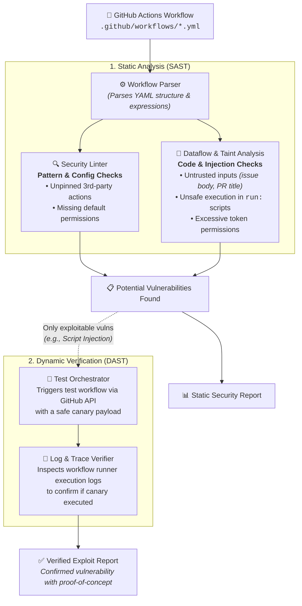

# ActionLens 👾

**ActionLens** is a static and dynamic analysis tool (SAST + DAST) designed to audit GitHub Actions CI/CD workflows for security vulnerabilities, unsafe data flows, and configuration weaknesses.

---

## 🎯 Objectives & Scope

Modern CI/CD pipelines hold privileged access to source code, cloud credentials, production environments, and release artifacts. ActionLens targets security risks in workflow definitions across two coordinated layers:

### 1. Static Analysis (SAST)
- **Semantic Code & Taint Analysis:**
  - Evaluates untrusted data flows from external triggers (e.g., `pull_request_target`, `issue_comment`, `workflow_run`) to dangerous execution sinks (e.g., inline shell scripts via `${{ github.event... }}`).
  - Analyzes privilege over-scoping (default permissions vs. explicit least-privilege tokens).
- **Security Linting:**
  - AST-based pattern matching for supply-chain risks (e.g., unpinned third-party actions using mutable tags like `@v1` or `@main` instead of immutable commit SHAs).
  - Dangerous configuration patterns (e.g., insecure checkouts, missing environment isolation).

### 2. Dynamic Verification (DAST / Exploit Harness - Research Layer)
- **API Orchestrator & Log Verifier:**
  - In controlled environments (test repositories / ephemeral runners), triggers and orchestrates targeted execution of flagged workflows.
  - Verifies whether an identified candidate vulnerability is genuinely exploitable by inspecting execution traces and runner logs.

---

## 🗿 Architecture Overview



For detailed specifications, see:
- [Architecture Guide](file:///Users/chinz/projects/KTH/actionlens/docs/architecture.md)
- [Vulnerability Matrix & Research Roadmap](file:///Users/chinz/projects/KTH/actionlens/docs/vulnerability-matrix.md)
- [Agent Guide (`AGENTS.md`)](file:///Users/chinz/projects/KTH/actionlens/AGENTS.md)
- [Development & Contribution Guide](file:///Users/chinz/projects/KTH/actionlens/docs/development.md)

---

## 📁 Repository Layout

```text
actionlens/
├── README.md                  # Project overview and roadmap
├── docs/                      # Architectural specifications and research documentation
│   ├── architecture.md        # Technical architecture (SAST & DAST layers)
│   ├── vulnerability-matrix.md# Catalog of targeted vulnerabilities & statuses
│   └── development.md         # Guide for implementing new rules and test cases
├── parser/                    # Go-based AST parser frontend (actionlint wrapper)
│   ├── main.go                # Emits normalized AST JSON
│   ├── go.mod
│   └── go.sum
├── actionlens/                # Core Python package (SAST, Taint, DAST, CLI)
│   ├── cli.py                 # CLI commands (scan, verify, lint)
│   ├── models.py              # Pydantic schemas (AST, Rules, Findings)
│   ├── sast/                  # Linter & NetworkX taint graph engine
│   ├── dast/                  # GitHub API orchestrator & log verifier
│   └── reporting/             # Console, SARIF, and JSON formatters
├── testdata/                  # Test workflows (benign & vulnerable samples)
│   ├── vulnerable/            # Vulnerable workflow samples for regression tests
│   └── secure/                # Remediated & safe workflow samples
└── tests/                     # Pytest test suite
```

---

## ⚡ Planned Initial Vulnerability Targets

| Category                 | Vulnerability / Check              | Detection Mechanism                                                                | Status         |
| :----------------------- | :--------------------------------- | :--------------------------------------------------------------------------------- | :------------- |
| **SAST (Code Analysis)** | **Script / Expression Injection**  | Taint flow graph: Untrusted trigger context to inline `run:` script                | Planned (MVP)  |
| **SAST (Code Analysis)** | **Excessive Token Permissions**    | Workflow & job-level `permissions` block evaluation                                | Planned (MVP)  |
| **SAST (Linting)**       | **Unpinned Third-Party Actions**   | AST inspection of `uses:` step clauses (require full commit SHA)                   | Planned (MVP)  |
| **SAST (Linting)**       | **Dangerous Pull Request Target**  | Check if `pull_request_target` combines with explicit checkout of untrusted PR ref | Researched     |
| **DAST (Verification)**  | **Injection Exploit Verification** | API harness triggering candidate workflow with non-destructive canary payload      | Research / PoC |

Detailed breakdown and research notes can be found in [`docs/vulnerability-matrix.md`](file:///Users/chinz/projects/KTH/actionlens/docs/vulnerability-matrix.md).

---

## 📜 License

[MIT](file:///Users/chinz/projects/KTH/actionlens/LICENSE)
