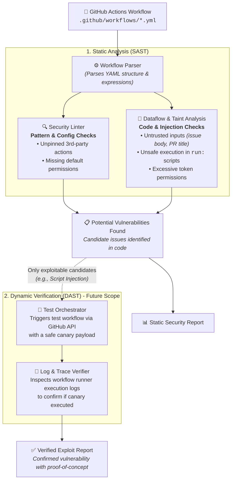

# ActionLens Architecture Specification

This document details the architectural design of **ActionLens**, covering both the static analysis (SAST) pipeline and the dynamic verification (DAST) orchestrator.

---

## 1. High-Level System Architecture



---

## 2. SAST Subsystem

The static analysis pipeline consists of two complementary layers operating on the normalized AST:

### 2.1 Security Linting Layer (`actionlens/sast/rules/lint/`)
The linter performs AST pattern matching on workflow structure and metadata without constructing dataflow graphs.

- **Input:** `WorkflowAST` (parsed from the Go frontend's JSON output).
- **Scope:**
  - Structural configuration (e.g., presence and scoping of `permissions:` blocks).
  - Unpinned third-party actions (`uses:` format analysis).
  - Runner configurations (e.g., self-hosted runner risks on public repositories).
- **Rule Interface (Python):**
  ```python
  from actionlens.models import Rule, Finding, WorkflowAST

  class LintRule(Rule):
      id: str
      name: str
      description: str

      def check(self, ast: WorkflowAST) -> list[Finding]:
          ...
  ```

---

### 2.2 Semantic & Taint Analysis Layer (`actionlens/sast/taint.py`, `actionlens/sast/rules/codeanalysis/`)
The semantic layer models dataflow from untrusted external inputs across steps and environment variables to execution points.

#### Concepts:
1. **Sources (Untrusted Input):**
   Context expressions populated by external users or untrusted triggers.
   - Examples: `github.event.issue.body`, `github.event.pull_request.title`, `github.event.comment.body`, `github.head_ref`.
2. **Propagators:**
   Mechanisms that pass values between contexts:
   - Environment variables (`env:` mappings).
   - Step outputs (`steps.<id>.outputs.<var>`).
   - Job outputs and reusable workflow inputs.
3. **Sanitizers:**
   Patterns that mitigate execution risk:
   - Assigning untrusted input to an environment variable rather than direct inline string interpolation:
     ```yaml
     # Safe: Shell variable evaluated at runtime
     env:
       TITLE: ${{ github.event.issue.title }}
     run: echo "$TITLE"
     ```
4. **Sinks (Execution Points):**
   Locations where strings are executed as code:
   - `run:` steps (shell commands).
   - `actions/github-script` script bodies.

#### Graph Representation:
Using **NetworkX** (`networkx.DiGraph`), ActionLens constructs a **Taint Flow Graph**:
- **Nodes:** Represent Sources, Environment bindings, and Sinks.
- **Edges:** Directed data flow connections between variables and expressions.
- **Vulnerability Condition:** A path exists in the directed graph from an untrusted **Source** node to an execution **Sink** node without passing through a designated **Sanitizer**.

---

# (Future Scope)

## 3. DAST Verification Subsystem (`actionlens/dast/`)

The DAST layer is an optional validation harness designed to verify candidate findings by testing them in an authorized sandbox environment.

### 3.1 Verification Process
1. **Candidate Ingestion:**
   Takes candidate findings from SAST (e.g., suspected expression injection in an `issue_comment` trigger).
2. **Safe Canary Generation:**
   Generates a non-destructive probe string with a unique token (e.g., `CANARY_VERIFIED_<UUID>`).
3. **Orchestrated Trigger:**
   Uses GitHub REST APIs via `httpx` / `PyGithub` to trigger the candidate workflow with the canary token.
4. **Log & Trace Verification:**
   Polls workflow run status via GitHub Actions API, downloads execution logs, and checks for the canary token in stdout/stderr.
5. **Report Generation:**
   If the canary token executed in the sink context, the finding is confirmed as verified.

> [!CAUTION]
> DAST verification MUST only run against authorized, isolated sandbox repositories.

---

## 4. Reporting (`actionlens/reporting/`)

ActionLens produces structured diagnostic output conforming to industry standards:
- **SARIF v2.1.0:** Compatible with GitHub Advanced Security / Code Scanning.
- **JSON:** Machine-readable output for CI/CD integrations.
- **Terminal (Rich Text):** Human-readable diagnostic output highlighting file, line number, code snippet, taint trace, and remediation advice.
